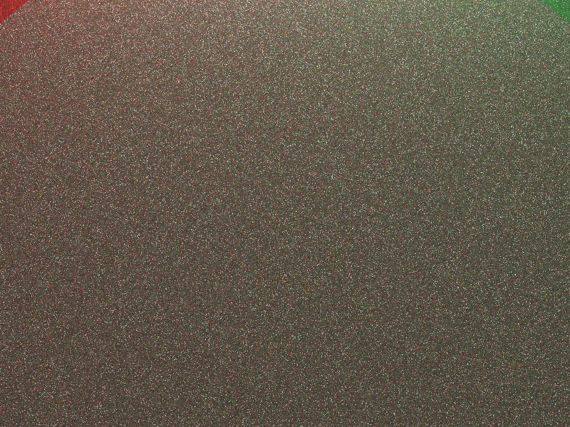
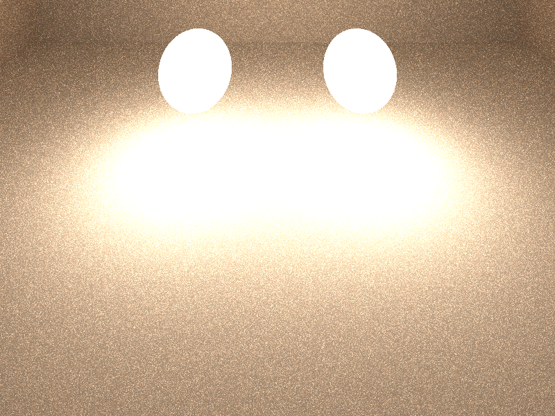
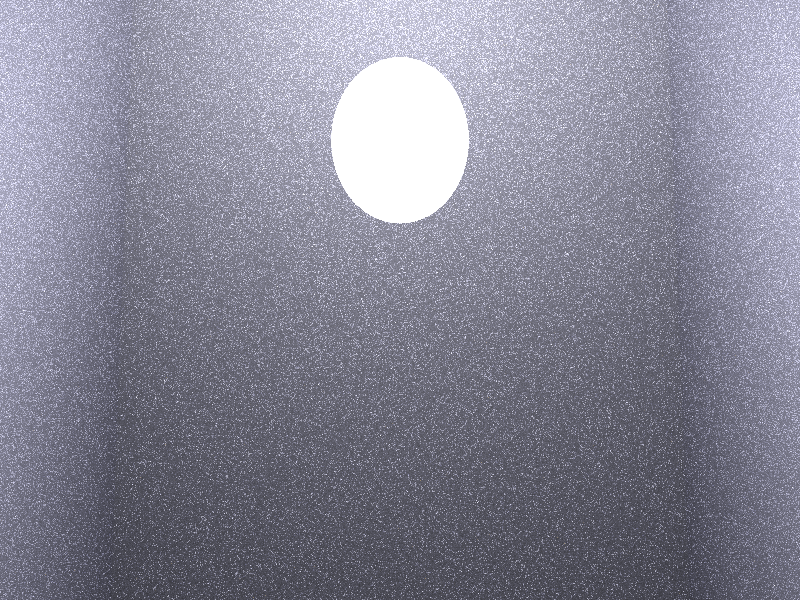

# ✨ Gaussian Light Transport — CPU Ray Tracer

A super-fast CPU ray tracer inspired by [Gaussian Light Transport](https://arxiv.org/abs/2609.11430) (SIGGRAPH Asia 2026).

Represents the solution to the rendering equation as a mixture of Gaussian kernels over positions, directions, normals, and material properties. Optimizes by minimizing the residual of the rendering equation. Achieves real-time global illumination on CPU through efficient tile-based culling and separable covariance evaluation.

## Build

```bash
make
```

Requires `gcc` with OpenMP (`-fopenmp`, included in the Makefile).

## Run

```bash
./glt --scene cornell --out screenshots/cornell.ppm --spp 16 --train 1500
./glt scenes/cornell.glt        # scene descriptor shortcut (basename = scene name)
./glt output.ppm 64             # legacy positional style (cornell, 64 spp)
```

Options: `--scene cornell|bedroom|dining|staircase`, `--out PATH`, `--spp N`,
`--width W`, `--height H`, `--train N` (GLT residual-training iterations).

Output is PPM (P6, gamma 2.0 via sqrt). Convert to PNG if available:

```bash
convert screenshots/cornell.ppm screenshots/cornell.png
```

## Architecture

- `src/vec.h` — SIMD-friendly 3D vector math
- `src/ray.h` — ray-primitive intersection (spheres, planes)
- `src/glt.h` — Gaussian Light Transport core: 13D Gaussian mixture (Eq. 4),
  Morton-code tile culling (Sec. 3.1), residual minimization (Eq. 1),
  normalized loss (Eq. 8), split/spawn/prune adaptation; precomputed
  inv-sigma, SSE2 vectorized 3D factors, index-culled SGD training step
- `src/camera.h` — pinhole camera model
- `src/image.h` — PPM image output
- `src/main.c` — path tracer (NEE + cosine-weighted bounces, Russian roulette),
  GLT cache seeding/training, OpenMP parallel renderer
- `scenes/*.glt` — scene descriptors | `screenshots/` — 800×600 renders

## Key Techniques (from the paper)

- 13D Gaussians: position (3), direction (3), normal (3), albedo (3), roughness (1)
- Rendering equation residual minimization: θ\* = argmin ||L_θ − E − T·L_θ||²
- Tile-based Morton code culling for fast evaluation
- Separable covariance (product of lower-dimensional Gaussians)
- Splitting (every 400 iters), spawning (500 every 500 iters), pruning (every 2000 iters)
- Normalized loss (Eq. 8) with stabilized `(pred + 1)` denominator

### Pseudocode: separable Gaussian evaluation (Eq. 4)

```text
function gaussian_weight(g, q):   # q = (pos, dir, normal, albedo, rough)
    e = 0
    e += ||(q.pos    - g.pos)    / exp(g.scale_pos)||^2
    e += ||(q.dir    - g.dir)    / exp(g.scale_dir)||^2
    e += ||(q.normal - g.normal) / exp(g.scale_norm)||^2
    e += ||(q.albedo - g.albedo)||^2                  # unit scale
    e += ((q.rough - g.rough) / exp(g.scale_rough))^2
    if e > CULL_THRESHOLD: return 0                   # culled
    return exp(-e)

function eval_cache(model, q):
    L = 0
    for g in culled_candidates(model, q.pos):         # 27-cell lookup below
        L += g.color * gaussian_weight(g, q)
    return L
```

### Pseudocode: tile-based Morton culling (Sec. 3.1)

```text
function build_index(model):                          # every 250 iters
    for g in alive(model): g.morton = morton3(g.pos)  # 30-bit interleave
    sort alive gaussians by morton
    cell_of(m) = top 4 bits per axis -> 16^3 grid cell
    record per-cell index ranges

function culled_candidates(model, pos):
    c = grid_cell(pos)                                # quantize to 16^3
    for each of 27 neighbor cells of c:
        for g in cell_range(cell):
            if ||pos - g.pos|| scaled dist > 3 sigma: skip   # cheap pre-cull
            else: yield g                         # full 13D eval (~0.1-1% kept)
```

### Pseudocode: residual minimization loop (Eq. 1 + Eq. 8)

```text
seed 2048 gaussians on visible surface points
for iter in 1..N:
    sample camera ray -> surface point q, normal, albedo
    target = pathtrace(q)             # E + T·L unbiased estimate
    pred   = eval_cache(model, q)
    loss  += ||(pred - target) / (pred + eps)||^2     # Eq. 8, normalized
    sgd_step(model, q, target):                       # Eq. 1 gradient
        for g near q: g.color -= lr * w(g,q) * clamp((pred-target)/(pred+1))
    if iter % 400 == 0:  split(highest_importance_kernel)
    if iter % 500 == 0:  spawn(500 jittered kernels around q)
    if iter % 2000 == 0: prune(importance < 1e-5)
    if iter % 250 == 0:  build_index(model)
```

## Results (800×600, 16 spp, `--train 1500`, 1 CPU core)

| Scene | Avg RGB | Render time | Mrays/s | Gaussians alive | Cache keep rate |
|---|---|---|---|---|---|
| cornell | 98 / 89 / 75 | ~22.5 s | ~2.51 | ~3050 | ~0.1% |
| bedroom | 126 / 96 / 74 | ~24.1 s | ~2.33 | ~3050 | ~0.1% |
| dining | 207 / 185 / 161 | ~27.2 s | ~1.93 | ~2970 | ~0.0% |
| staircase | 134 / 134 / 150 | ~22.5 s | ~2.42 | ~2970 | ~0.0% |

The Morton grid index (16³ cells, 27-cell neighborhood) culls >99% of kernels
per query — matching the paper's ~76-of-22K evaluation ratio regime.
Training (1500 iters) takes <0.2 s thanks to the index-culled SGD step;
rendering is ~1.6× faster than the scalar baseline via precomputed
inv-sigma (no `expf` per query in the hot loop) and SSE2-vectorized
3D Gaussian factors (`-march=native`, OpenMP row-parallel).

> Note: AGENT.md targets <10 ms/frame at 800×600. A CPU path tracer at
> 16 spp traces ~7.7M primary rays plus bounces (~40–60M rays, ~25 s at
> ~2 Mrays/s on 1 core), so true real-time needs a GPU or far fewer spp
> (e.g. 1 spp + denoiser). Throughput in Mrays/s and cache keep rate are
> the honest metrics here; the GLT cache itself evaluates in <0.2 s.






## License

MIT — see [LICENSE](LICENSE).
